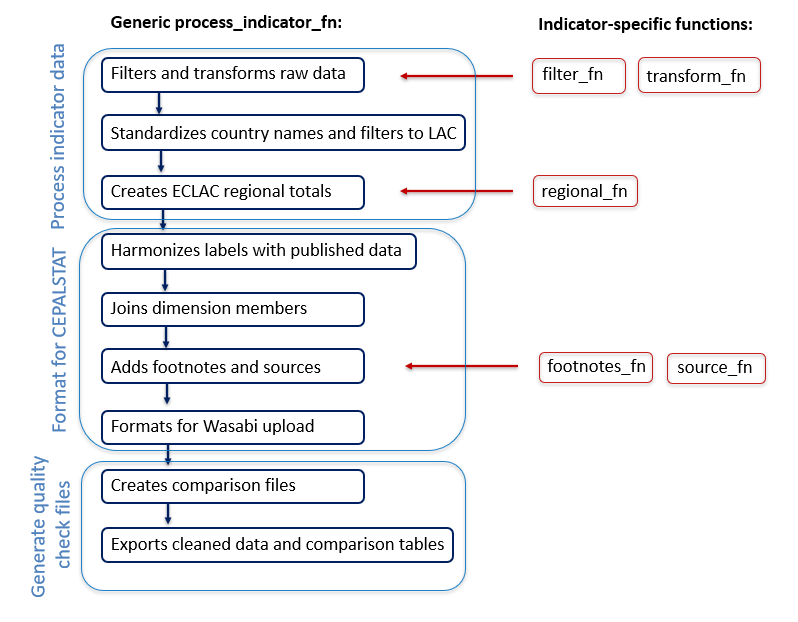

# cepalstat-data-upload

Automates the collection and cleaning of environmental indicators in the CEPALSTAT database.

## Overview

This repository contains scripts to download, clean, standardize, and quality-check environmental indicator data from multiple sources (FAO, Climate Watch, EM-DAT, OLADE) for upload to the CEPALSTAT database. The workflow ensures data consistency, validates against existing published data, and generates quality control reports.

## General Process

1.  **Download data** [01 files] - Fetch raw data from external sources
2.  **Clean data** [02 files] - Standardize, filter, and transform data to CEPALSTAT format
3.  **Run QC checks** [03 file] - Generate quality control reports comparing new data with published data
4.  **Review QC reports** - Identify discrepancies, missing data, and statistical anomalies
5.  **Backup existing data** - Download the plantilla de ingresos of the old data from the data management system (as a backup copy, and take note of any footnotes)
6.  **Upload cleaned data to Wasabi** - Final upload of validated data

## Scripts Directory

### Data Download Scripts (01\_\*)

#### `01_climatewatch.R`

-   Downloads historical emissions data from the Climate Watch Data API
-   Retrieves data for multiple indicators (2027, 3158, 3159, 3351, 5649, 5650)
-   Filters for LAC countries and World aggregates
-   Saves raw data to `Data/Raw/climate watch/`

#### `0102_fao.R` / `0102_fao_manual.R`

-   **`0102_fao.R`**: Automated FAO data processing using the centralized `process_indicator()` function
    -   Downloads bulk data from FAOSTAT API (land use, climate change, land cover, crops/livestock, fertilizers, pesticides)
    -   Manually processes fish capture and aquaculture data from FishStat
    -   Processes Aquastat water withdrawal data
    -   Processes multiple FAO indicators in a standardized workflow
-   **`0102_fao_manual.R`**: Manual FAO processing script with indicator-by-indicator approach
-   Both scripts use the `FAOSTAT` R package and require manual downloads for FishStat and Aquastat data

### Data Cleaning Scripts (02\_\*)

#### `02_climatewatch.R`

-   Cleans and standardizes CAIT-WRI / Climate Watch indicators
-   Processes indicators: 2027, 3158, 3159, 3351, 5649, 5650
-   Standardizes country names, filters to LAC countries, creates regional aggregates
-   Uses the centralized `process_indicator()` function for consistent processing

#### `02_emdat.R`

-   Cleans and standardizes EM-DAT disaster indicators
-   Processes natural disaster data (deaths, affected, economic damage)
-   Requires manual download from <https://public.emdat.be/> (user account needed)
-   Filters for LAC countries, standardizes disaster classifications

#### `02_olade_manual.R`

-   Processes OLADE (Latin American Energy Organization) energy indicators
-   Handles complex Excel file structures with multiple sheets and headers
-   Standardizes country names and energy classifications
-   See `Data/Raw/olade/energy_indicators_overview.xlsx` for detailed cleaning notes

### Quality Control Scripts (03\_\*)

#### `03_qc_report.qmd`

-   Quarto document that generates interactive HTML quality control reports
-   Compares new cleaned data with currently published CEPALSTAT data
-   Identifies:
    -   Missing entries (present in old data but not new)
    -   New entries (present in new data but not old)
    -   Large differences (\>20% relative change)
    -   Statistical anomalies
-   Generates visualizations and summary tables
-   Reports saved to `QC Reports/` directory
-   See `Docs/qc_report_good.qmd` and `Docs/qc_report_bad.qmd` for sample indicator QC reports

### Utility Scripts

#### `utils.R`

Core utility functions used across all processing scripts:

-   **Data validation**: `assert_no_na_cols()`, `assert_no_duplicates()`
-   **CEPALSTAT API integration**:
    -   `get_indicator_dimensions()` - Get indicator dimension structure
    -   `get_indicator_footnotes()` - Retrieve footnotes
    -   `get_indicator_metadata()` - Get indicator metadata
    -   `get_indicator_sources()` - Get data sources
    -   `get_cepalstat_data()` - Fetch published indicator data
    -   `get_full_dimension_table()` - Get dimension member tables
-   **Data formatting**:
    -   `format_for_wasabi()` - Format data for Wasabi upload
    -   `join_data_dim_members()` - Join dimension IDs to data
    -   `match_cepalstat_labels()` - Match dimension IDs to readable labels
-   **Comparison utilities**:
    -   `create_comparison_checks()` - Create comparison tables
    -   `get_comp_summary_table()` - Summarize dimension overlap

#### `process_indicator_fn.R`

Centralized indicator processing function that standardizes the workflow:



-   **`process_indicator()`**: Main function that handles the complete processing pipeline:
    1.  Filters and transforms raw data
    2.  Standardizes country names and filters to LAC
    3.  Creates ECLAC regional totals
    4.  Harmonizes labels with published data
    5.  Joins dimension members
    6.  Adds footnotes and sources
    7.  Formats for Wasabi upload
    8.  Creates comparison files
    9.  Exports cleaned data and comparison tables
    10. Updates indicator metadata

#### `build_iso_table.R`

-   Creates standardized ISO code mapping table
-   Maps various country name spellings to CEPALSTAT standard names and IDs
-   Integrates ISO codes from multiple sources
-   Output: `Data/iso_codes.xlsx`

#### `build_metadata_table.R`

-   Builds indicator metadata tracking table
-   Retrieves indicator information from CEPALSTAT API
-   Tracks dimensions, sources, and metadata for all environmental indicators
-   Output: `Data/indicator_metadata.xlsx`

## Data Sources

### FAO (Food and Agriculture Organization)

-   **FAOSTAT**: Land use, climate change, land cover, crops/livestock, fertilizers, pesticides
-   **FishStat**: Fish capture and aquaculture production
-   **Aquastat**: Water withdrawal by sector

### Climate Watch (CAIT-WRI)

-   Historical greenhouse gas emissions
-   Multiple indicators covering CO₂, CH₄, N₂O emissions
-   Share of global emissions

### EM-DAT (Emergency Events Database)

-   Natural disaster data
-   Deaths, affected populations, economic damage
-   Requires manual download with user account

### OLADE (Latin American Energy Organization)

-   Energy production and consumption indicators
-   Complex Excel files requiring specialized parsing

## Data Structure

```         
Data/
├── Raw/              # Raw downloaded data from sources
│   ├── climate watch/
│   ├── emdat/
│   ├── fao fish and aqua/
│   └── olade/
├── Cleaned/          # Processed data ready for upload (format: id{indicator_id}_{timestamp}.xlsx)
├── Checks/           # Comparison files (comp_id{indicator_id}.xlsx)
├── iso_codes.xlsx    # Country name and ISO code mappings
└── indicator_metadata.xlsx  # Indicator tracking metadata
```

## Key Features

-   **Standardized Processing**: Centralized `process_indicator()` function ensures consistent data handling
-   **Automated Validation**: Built-in checks for duplicates, missing values, and data integrity
-   **Quality Control**: Automated comparison with published data to identify discrepancies
-   **Metadata Tracking**: Automatic tracking of script versions, last run dates, and processing notes
-   **Regional Aggregates**: Automatic calculation of LAC regional totals
-   **Dimension Mapping**: Automatic mapping of source data to CEPALSTAT dimension structure

## Dependencies

Key R packages:

-   `tidyverse`, `magrittr` - Data manipulation
-   `httr2`, `jsonlite` - API interactions
-   `readxl`, `writexl` - Excel file handling
-   `CepalStatR` - CEPALSTAT API wrapper
-   `FAOSTAT` - FAO data access
-   `quarto` - Report generation
-   `assertthat` - Data validation

## Usage Notes

1.  **Manual Downloads**: Some data sources (EM-DAT, FishStat, Aquastat) require manual downloads due to authentication or complex interfaces
2.  **ISO Codes**: Ensure `Data/iso_codes.xlsx` is up to date for proper country name matching
3.  **Metadata**: The `indicator_metadata.xlsx` file tracks processing history and should be updated automatically
4.  **QC Review**: Always review QC reports before uploading to identify potential issues
5.  **Backup**: Always download existing data from the data management system before uploading new data

## Output Files

-   **Cleaned Data**: `Data/Cleaned/id{indicator_id}_{timestamp}.xlsx` - Ready for Wasabi upload
-   **Comparison Files**: `Data/Checks/comp_id{indicator_id}.xlsx` - Detailed comparison with published data
-   **QC Reports**: `QC Reports/qc_report_{indicator_id}.html` - Interactive quality control reports
