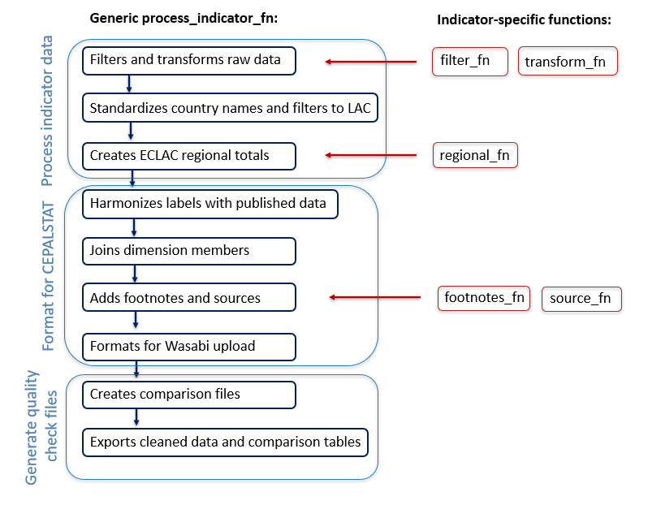

# cepalstat-data-upload

Automates the collection, cleaning, and quality control of environmental indicators for the CEPALSTAT database.

## Overview

This repository contains scripts to download, clean, standardize, and quality-check environmental indicator data originating from regional or international data sources (such as FAO, OLADE, Climate Watch, and EM-DAT) for upload to the CEPALSTAT database. The workflow ensures data consistency, validates against existing published data, and generates quality control reports.

## Process Flow

1.  **Download data** - Fetch raw data from external sources. (Associated files start with `01_` and are organized by source.)
2.  **Clean data** - Standardize, filter, and transform data to CEPALSTAT format. (Associated files start with `02_` and are organized by source.)
3.  **Run QC check and manually review** - Generate quality control reports comparing new data with published data using file `03_qc_report.qmd`. Manually review the file by checking for any discrepancies, missing data, or statistical anomalies.
4.  **Upload cleaned data to Wasabi** - Manually upload the validated data in folder `Data/Cleaned/` to [Wasabi](ETL%20%7C%20LOGIN), CEPALSTAT's automated data ingestion tool.
5.  **Revise metadata** (optional) - Leverage AI to standardize indicator metadata using file `04_technical_sheet.R`.

## Scripts

| Script | Purpose |
|------------------------------------|------------------------------------|
| `01_climatewatch.R` | Download Climate Watch emissions data via API |
| `01_olade.R` | Download OLADE energy data |
| `01_informea.qmd` | Download InforMEA environmental treaty data |
| `02_climatewatch.R` | Clean and standardize Climate Watch indicators |
| `02_emdat.R` | Clean EM-DAT natural disaster data |
| `02_olade.R` | Clean and standardize OLADE energy indicators |
| `02_other.R` | Clean miscellaneous indicators |
| `0102_fao.R` | Download and clean FAO data (FAOSTAT, FishStat, Aquastat) |
| `03_qc_report.qmd` | Generate QC HTML report comparing new vs. published data |
| `04_technical_sheet.R` | Generate technical metadata sheet for upload |
| `utils.R` | Shared utility functions (API calls, formatting, validation) |
| `process_indicator_fn.R` | Core `process_indicator()` function used by all cleaning scripts |
| `build_iso_table.R` | Build/update country name → ISO code mapping (`Data/iso_codes.xlsx`) |
| `build_metadata_table.R` | Build/update indicator metadata table (`Data/indicator_metadata.xlsx`) |

## The `process_indicator()` Function

The `process_indicator_fn.R` script defines the central function used by all `02_*` cleaning scripts. It handles the full pipeline in a standardized way:



## Data Sources

| Source | Data | Download method |
|------------------------|------------------------|------------------------|
| FAO (FAOSTAT) | Land use, climate change, land cover, crops/livestock, fertilizers, pesticides | Automated via `FAOSTAT` R package |
| FAO (FishStat / Aquastat) | Fish capture, aquaculture, water withdrawal | Manual download required |
| Climate Watch | GHG emissions (CO₂, CH₄, N₂O, etc.) | Automated via API |
| EM-DAT | Natural disaster deaths, affected, economic damage | Manual download (account required at emdat.be) |
| OLADE | Energy production and consumption | Manual download |
| InforMEA | Environmental treaty indicators | See `01_informea.qmd` |

## Key Files

```         
Scripts/          # All R and Quarto scripts
Data/
├── Raw/          # Raw source downloads
├── Cleaned/      # Final files for Wasabi upload (id{indicator_id}_{timestamp}.xlsx)
├── Checks/       # Comparison files vs. published data (comp_id{indicator_id}.xlsx)
├── iso_codes.xlsx           # Country name ↔ CEPALSTAT ID mapping
└── indicator_metadata.xlsx  # Indicator tracking and processing history
Docs/
├── process_indicator_flowchart.png  # Visual diagram of process_indicator()
└── qc_report_good.html              # Sample QC reports (good / bad examples)
QC Reports/       # Generated QC HTML reports
```
