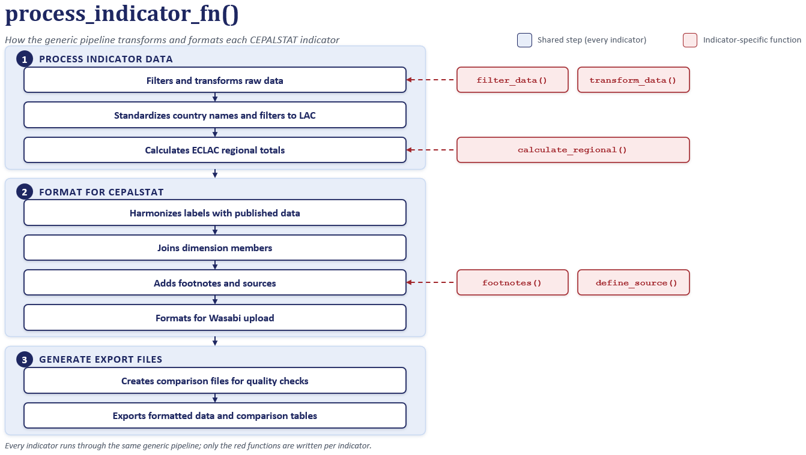
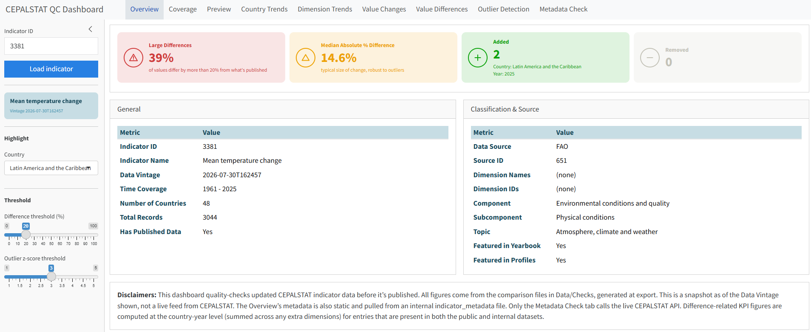
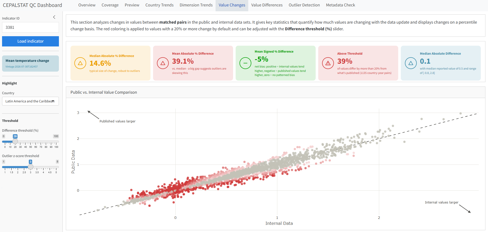

# cepalstat-data-upload

Automates the collection and cleaning of environmental indicators in the [CEPALSTAT](https://statistics.cepal.org/portal/cepalstat/dashboard.html?theme=3&lang=en) database.

## Overview

This repository contains scripts to download, clean, standardize, and quality-check environmental indicator data originating from regional or international data sources (such as FAO, OLADE, Climate Watch, and EM-DAT) for upload to the CEPALSTAT database. The workflow ensures data consistency, validates against existing published data, and supports interactive quality review.

## Process Flow

1.  **Download data** - Fetch raw data from external sources. Some source data must be downloaded manually and others can be fetched automatically via APIs.
2.  **Clean data** - Standardize, filter, and transform data to CEPALSTAT format.
3.  **Quality check and manually review** - Use the interactive Quarto dashboard to compare new data with published data, and manually review it for discrepancies, missing data, or statistical anomalies.
4.  **Upload cleaned data to Wasabi** - Manually upload the validated data to Wasabi, CEPALSTAT's automated data ingestion ETL.
5.  **Revise metadata and manually review** (optional) - Leverage AI to standardize indicator metadata.

## Data Sources

| Source | Data | Associated steps/files |
|---|---|---|
| FAO | Land use, climate change, land cover, crops/livestock, fertilizers, pesticides, fish capture, aquaculture, water withdrawal | Download and clean with `fao.R`, which uses the `FAOSTAT` R package |
| OLADE | Energy production and consumption | <ul><li>Manual download following `manual_olade.qmd` instructions</li><li>Restructure raw data with `format_olade.R`</li><li>Clean with `olade.R`</li></ul> |
| Climate Watch | GHG emissions (CO₂, CH₄, N₂O, etc.) | API download with `download_climatewatch.R` |
| EM-DAT | Natural disaster deaths, affected, economic damage | <ul><li>Manual download following `manual_download.qmd`</li><li>Clean with `emdat.R`</li></ul> |
| InforMEA | Environmental treaty indicators | <ul><li>Download with `download_informea.qmd`, which scrapes web data from informea.org</li><li>Clean with `other.R`</li></ul> |
| Other (UNEP/Ramsar/IRENA/ISO Survey) | | <ul><li>Download with `manual_download.qmd`</li><li>Clean with `other.R`</li></ul> |

+--------------------------------------+-----------------------------------------------------------------------------------------------------------------------------+-----------------------------------------------------------------------------------+
| Source                               | Data                                                                                                                        | Associated steps/files                                                            |
+======================================+=============================================================================================================================+===================================================================================+
| FAO                                  | Land use, climate change, land cover, crops/livestock, fertilizers, pesticides, fish capture, aquaculture, water withdrawal | - Download and clean with `fao.R`, which uses the `FAOSTAT` R package             |
+--------------------------------------+-----------------------------------------------------------------------------------------------------------------------------+-----------------------------------------------------------------------------------+
| OLADE                                | Energy production and consumption                                                                                           | - Manual download following `manual_olade.qmd` instructions                       |
|                                      |                                                                                                                             |                                                                                   |
|                                      |                                                                                                                             | - Restructure raw data with `format_olade.R`                                      |
|                                      |                                                                                                                             |                                                                                   |
|                                      |                                                                                                                             | - Clean with `olade.R`                                                            |
+--------------------------------------+-----------------------------------------------------------------------------------------------------------------------------+-----------------------------------------------------------------------------------+
| Climate Watch                        | GHG emissions (CO₂, CH₄, N₂O, etc.)                                                                                         | - API download with `download_climatewatch.R`                                     |
+--------------------------------------+-----------------------------------------------------------------------------------------------------------------------------+-----------------------------------------------------------------------------------+
| EM-DAT                               | Natural disaster deaths, affected, economic damage                                                                          | - Manual download following `manual_download.qmd`                                 |
|                                      |                                                                                                                             |                                                                                   |
|                                      |                                                                                                                             | - Clean with `emdat.R`                                                            |
+--------------------------------------+-----------------------------------------------------------------------------------------------------------------------------+-----------------------------------------------------------------------------------+
| InforMEA                             | Environmental treaty indicators                                                                                             | - Download with `download_informea.qmd`, which scrapes web data from informea.org |
|                                      |                                                                                                                             |                                                                                   |
|                                      |                                                                                                                             | - Clean with `other.R`                                                            |
+--------------------------------------+-----------------------------------------------------------------------------------------------------------------------------+-----------------------------------------------------------------------------------+
| Other (UNEP/Ramsar/IRENA/ISO Survey) |                                                                                                                             | - Download with `manual_download.qmd`                                             |
|                                      |                                                                                                                             |                                                                                   |
|                                      |                                                                                                                             | - Clean with `other.R`                                                            |
+--------------------------------------+-----------------------------------------------------------------------------------------------------------------------------+-----------------------------------------------------------------------------------+

## Detailed Steps

### 1. Download data

Download the raw data files manually or automatically. The manual download instructions are split between files `manual_olade.qmd` and `manual_download.qmd`. The automatic download processes are either contained in the `download_*.R` files if downloading the data is complicated or combined into the cleaning files if it's simple (e.g., in `fao.R`). See the Data Source table above for instructions by source.

The resulting files from this step can be found in the folder `Data/Raw`.

### 2. Clean data

The data cleaning phase standardizes, filters, and transforms the raw data into the CEPALSTAT (Wasabi) format.

The central function of the cleaning process is the `process_indicator()` function, which handles the full indicator processing pipeline in a standardized way:



The `process_indicator()` function, found in the file `process_indicator_fn.R,` is the workhorse for the indicator cleaning. It defines the shared processing steps between all indicators, such as standardizing country names, joining dimension members, and formatting for export.

The function accepts as input indicator-specific mini-functions defining how to filter, transform, calculate the regional aggregate, and define the source and footnotes–the steps that vary indicator-to-indicator.

The `spec_*` objects contain the list of indicator-specific values and functions that are passed to the `process_indicator()` function.

For example, indicator 2530 (Natural Forest Proportion of Total Forest from FAO) has the following spec:

``` r
spec_2530 <- indicator_spec(
  indicator_id = 2530,
  data = use,
  max_year = max_year_fao,
  dim_config = dim_config_2530,
  filter_data = filter_forest,
  transform_data = transform_2530,
  calculate_regional = calculate_regional_wgt_avg
)
```

Each of these values and functions are defined inside of the source file, in this case `fao.R`.

To clean and process indicators easily, utilize the wrapper script `run_all.R`.

The resulting files from this step can then be found in `Data/Cleaned` (for upload to Wasabi) and `Data/Checks` (for running the quality check dashboard).

### 3. Quality check data

Once the indicator data is exported, the QC dashboard can be used to compare the updated data values against what's currently published. The dashboard helps highlight any discrepancies, missing data, or statistical anomalies with the new data before uploading to CEPALSTAT/Wasabi.

The dashboard can be launched by navigating to the file `dashboard/dashboard.qmd` in RStudio and hitting "Run Document". This launches a local version of the dashboard that relies on the indicator comparison files in the `Data/Checks` folder.

There are different views in the dashboard to analyze different aspects of the updated data.

For instance, the `Overview` tab shows some highlight figures for how many data points have changed significantly, the mean % change, and how many new dimensions have been added or removed.



Another view is the `Value Changes` tab, which compares directly the values of the published vs internal data points:



A full list of the dashboard tabs and what they attempt to capture is:

- Overview - at a glance information on the indicator data quality

- Coverage - what dimensions (country/year/other) have been added or removed

- Preview - CEPALSTAT-like visual plotting the trend before and after the data update

- Country trends - displays trends at the country/year level

- Dimension trends - displays trends at the dimension/year level (if applicable)

- Value changes - compares matched pair values before and after the data update, shown in terms of percent changes

- Value differences - compares matched pair values before and after the data update, shown in terms of original data units

- Outlier detection - highlights country/dimension series that are internally inconsistent, ie have large outliers

- Metadata check - displays the indicator metadata side-by-side in English and Spanish

The interactive dashboard is designed to help illuminate data issues. Once these checks have been passed, one can have confidence in the updated data and proceed with the upload to Wasabi.

### 4. Upload data

Once the updated indicator data has been validated, it's time to manually upload the data to [Wasabi](ETL%20%7C%20LOGIN), CEPALSTAT's automated data ingestion tool. This requires an admin username and password, which can be requested from Andrés Yañez.

Once inside Wasabi: select "Add Task", set Group as ETL-BADEIMA, and select the associated indicator file from the folder `Data/Cleaned`. You may want to download a copy of the current data through the old data management system before selecting "Delete and insert".

Hitting "Send now" updates the new data to CEPALSTAT.

### 5. Revise metadata (optional)

An optional step is to update the indicator's technical sheet in CEPALSTAT. The script `technical_sheet.R` suggests updates to the metadata fields of Definition, Methodology and Comments.

The script fetches existing metadata from the CEPALSTAT API and calls the Anthropic API to produce an updated draft in English. This suggested draft is then **human-reviewed** and edited, before calling the Anthropic API again to translate it into Spanish. This is then exported into a CEPALSTAT Admin-friendly format and must be updated manually in the CEPALSTAT Admin area.

To manage this two-step metadata revision easily, utilize the wrapper script `run_meta.R`.

## Global Files

| Script | Associated Step | Purpose |
|---|---|---|
| `build_iso_table.R` | 0. setup | Build/update country name and ISO code mapping (`Data/iso_codes.xlsx`) |
| `build_metadata_table.R` | 0. setup | Build/update indicator metadata table (`Data/indicator_metadata.xlsx`) |
| `process_indicator_fn.R` | 2. clean data | Core `process_indicator()` function used by all cleaning scripts |
| `run_all.R` | 2. clean data | Controller for `process_indicator_fn.R` |
| `utils.R` | 2. clean data | Shared utility functions (API calls, formatting, validation) |
| `dashboard/dashboard.qmd` | 3. quality check | Interactive Quarto Dashboard for QC review |
| `technical_sheet.R` | 5. metadata | Generate technical metadata sheet |
| `run_meta.R` | 5. metadata | Controller for `technical_sheet.R` |

+---------------------------+-------------------+------------------------------------------------------------------------+
| Script                    | Associated Step   | Purpose                                                                |
+===========================+===================+========================================================================+
| `build_iso_table.R`       | 0\. setup         | Build/update country name and ISO code mapping (`Data/iso_codes.xlsx`) |
+---------------------------+-------------------+------------------------------------------------------------------------+
| `build_metadata_table.R`  | 0\. setup         | Build/update indicator metadata table (`Data/indicator_metadata.xlsx`) |
+---------------------------+-------------------+------------------------------------------------------------------------+
| `process_indicator_fn.R`  | 2\. clean data    | Core `process_indicator()` function used by all cleaning scripts       |
+---------------------------+-------------------+------------------------------------------------------------------------+
| `run_all.R`               | 2\. clean data    | Controller for `process_indicator_fn.R`                                |
+---------------------------+-------------------+------------------------------------------------------------------------+
| `utils.R`                 | 2\. clean data    | Shared utility functions (API calls, formatting, validation)           |
+---------------------------+-------------------+------------------------------------------------------------------------+
| `dashboard/dashboard.qmd` | 3\. quality check | Interactive Quarto Dashboard for QC review                             |
+---------------------------+-------------------+------------------------------------------------------------------------+
| `technical_sheet.R`       | 5\. metadata      | Generate technical metadata sheet                                      |
+---------------------------+-------------------+------------------------------------------------------------------------+
| `run_meta.R`              | 5\. metadata      | Controller for `technical_sheet.R`                                     |
+---------------------------+-------------------+------------------------------------------------------------------------+

## File Organization

```         
Scripts/          # All R and Quarto scripts
Data/
├── Raw/          # Raw source downloads
├── Cleaned/      # Final files for Wasabi upload (id{indicator_id}_{timestamp}.xlsx)
├── Checks/       # Comparison files vs. published data (comp_id{indicator_id}.xlsx)
├── iso_codes.xlsx           # Country name ↔ CEPALSTAT ID mapping
└── indicator_metadata.xlsx  # Indicator reference table (id, area, source, dimensions, notes), rebuilt via `build_metadata_table.R`
Docs/       # Misc documentation and visuals
```
